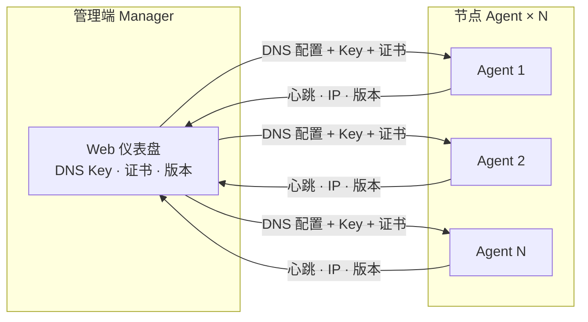

<p align="center">
  
</p>

<h1 align="center">DDNS-Manager</h1>

<p align="center">
  内嵌 <a href="https://github.com/jeessy2/ddns-go">ddns-go</a> DNS 引擎的集中管理平台<br/>
  统一管控 <b>DNS Key</b> · <b>SSL 证书</b> · <b>Agent 版本</b>
</p>

<p align="center">
  <a href="https://github.com/ocoj/ddns-manager/releases"></a>
  <a href="LICENSE"></a>
  <a href="https://go.dev"></a>
  <a href="https://github.com/ocoj/ddns-manager/actions"></a>
</p>

## 📖 简介

Manager 集中管控 DNS Key、SSL 证书与 Agent 版本；Agent 内嵌 ddns-go DNS provider 直接更新 DNS 记录，实现分布式 DDNS 集中管理。

## 📚 文档索引

| 文档 | 说明 |
|------|------|
| **[变更日志](CHANGELOG.md)** | 版本变更日志 |

## ✨ 特性

- 🗂️ **集中管理** — Web 仪表盘统一查看节点状态、IP、版本、健康
- 📡 **配置推送** — DNS 配置 + Key 注入 → Agent 热加载
- 🔐 **证书分发** — SSL 证书 AES-256-GCM 加密推送，Agent 自动部署
- ⚙️ **内嵌 DNS 引擎** — Agent 同进程运行 ddns-go DNS provider
- 🖥️ **跨平台** — Linux (systemd) + Windows 7+ (Windows Service)
- 🔄 **版本管理** — Git tag 驱动 + 符号链接安装 + 一键回滚

## 🏗️ 架构



## 📸 界面预览


## 快速开始

### Docker 部署（推荐）

```bash
# 拉取镜像
docker pull ghcr.io/ocoj/ddns-manager:latest

# 启动
docker run -d \
  --name ddns-manager \
  -p 9877:9877 \
  -v /opt/ddns-manager/data:/data \
  ghcr.io/ocoj/ddns-manager:latest
```

> 首次启动会生成默认管理员密码 `Admin12345`，请立即登录 Web UI 修改。

### 手动部署

```bash
# 构建
bash scripts/build.sh

# 一键部署到管理端（构建物检查 → 清理旧版 → 上传 → 校验）
bash scripts/deploy.sh

# 部署节点 (一键安装)
bash -c "$(curl -fsSL https://your-manager.example.com:30443/bin/install.sh)"
```

## 🛠️ 技术栈

| 类别 | 说明 |
|------|------|
| 语言 | Go 1.25+ |
| Web | gorilla/mux · 单文件 SPA (go:embed) · PWA 支持 |
| DNS 引擎 | ddns-go v6.17.4（内嵌 DNS provider） |
| 持久化 | JSON 文件 · AES-256-GCM 加密 · HKDF-SHA256 密钥派生 |
| 证书 | go-pkcs12 纯 Go PFX 生成 · ACME (Let's Encrypt / ZeroSSL / Google Trust) 双路径 |
| 配置 | YAML 解析 (gopkg.in/yaml.v3) |
| 通知 | SMTP 邮件通知 |
| 平台 | Linux systemd · Windows 7+ Service (golang.org/x/sys) |
| 分发 | Docker 镜像 (ghcr.io/ocoj/ddns-manager) |

## 版本

| 项目 | 版本号 | 说明 |
|------|--------|------|
| ddns-manager | **v1.6.64** | DNS Key 全局版本号持久化比对（方案B） |
| 安装器 | **v1.0.0** | 独立版本，与 Agent 解耦 |
| ddns-go (内嵌) | v6.17.4 | DNS provider library |

## 致谢

本项目 DNS 更新引擎采用 [ddns-go](https://github.com/jeessy2/ddns-go) (v6.17.4) 的 DNS provider 库。

引用方式：

- `internal/provider/registry.go` — 28 个 DNS 提供商注册表，直接引用 `github.com/jeessy2/ddns-go/v6/dns`
- `cmd/agent/dns_updater.go` — 内嵌 ddns-go DNS provider，同进程执行 DNS 记录更新
- Agent 二进制通过 `go mod` 声明依赖 `github.com/jeessy2/ddns-go/v6`

感谢 [jeessy2](https://github.com/jeessy2) 和所有 ddns-go 贡献者提供的高质量 DNS 引擎。
